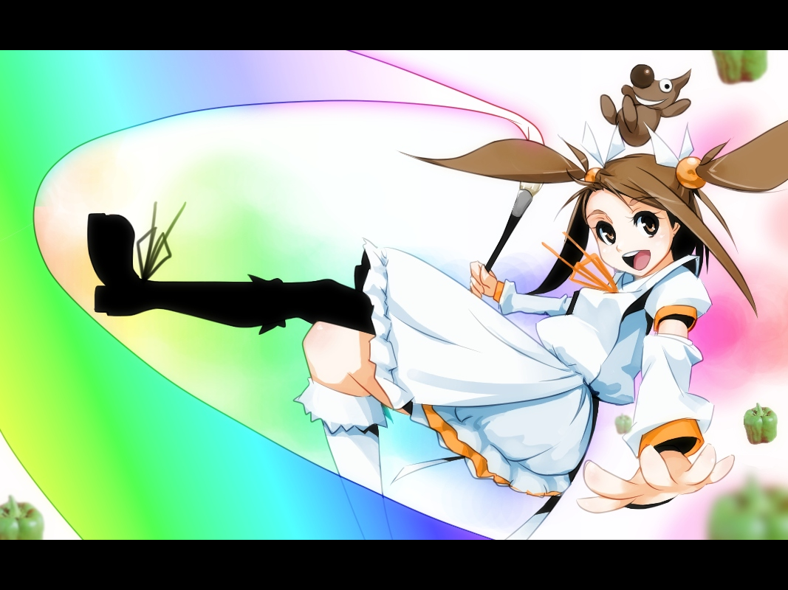
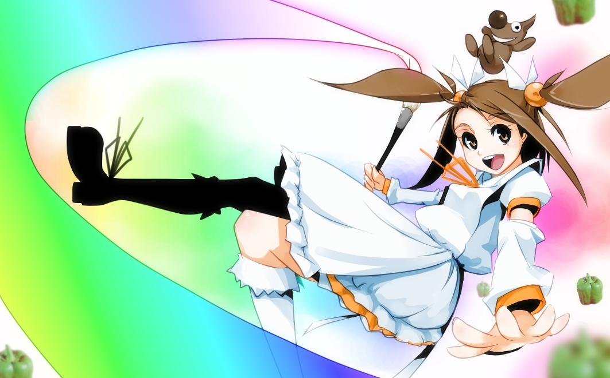
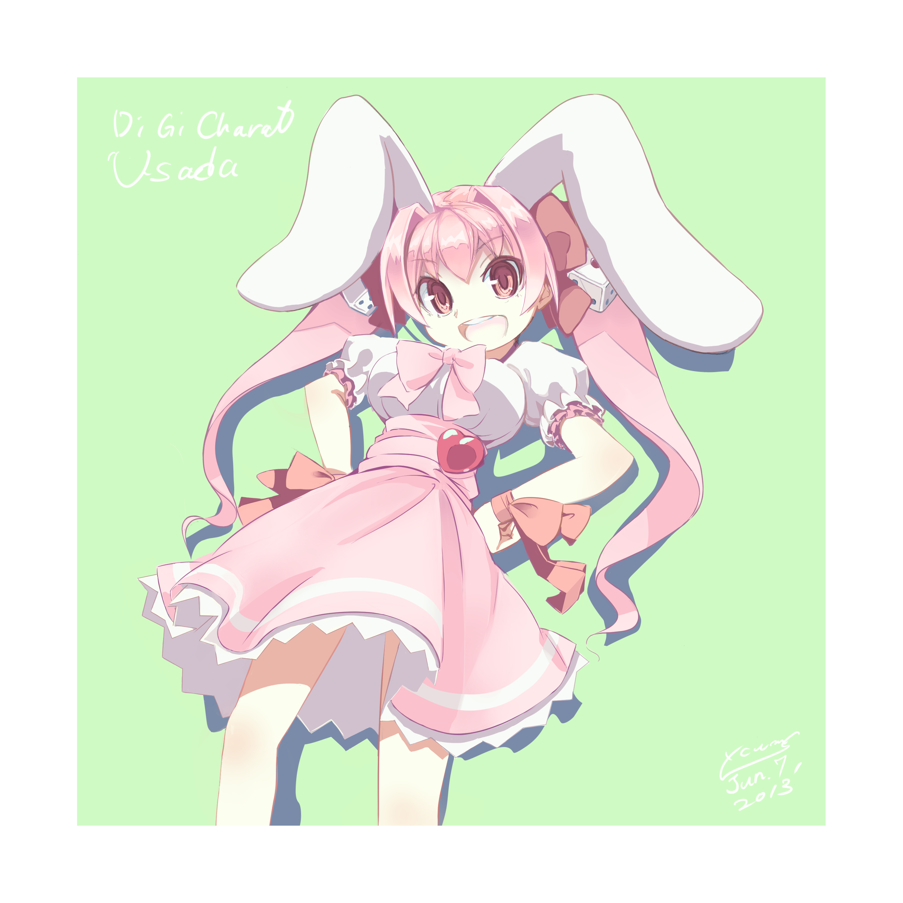
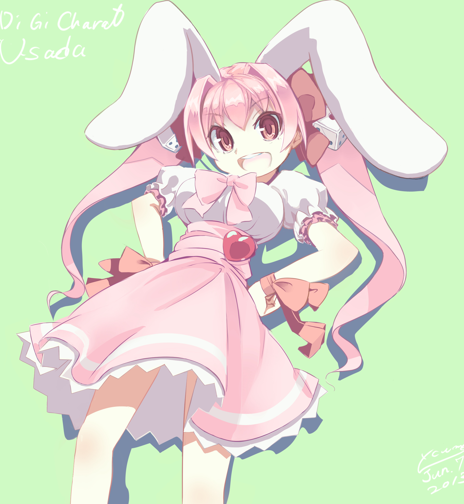

# image-margins-remove
Removes margins composed of the same color in an image.  

| include margins | removed margins |
| -- | -- |
|  |  |
|  |  |

- "[魔法少女 GIMPたん （ループ2.7.1週目 ver.）](https://www.flickr.com/photos/webdiver/5546529697/in/album-72157628077173905/)" by [Yama Q](https://www.flickr.com/photos/webdiver/) is licensed under [CC BY-NC 2.0](https://creativecommons.org/licenses/by-nc/2.0/)
- "[ruf13060101c](https://www.flickr.com/photos/webdiver/8978741478/in/album-72157628077173905/)" by [Yama Q](https://www.flickr.com/photos/webdiver/) is licensed under [CC BY-NC 2.0](https://creativecommons.org/licenses/by-nc/2.0/)

## usage
```
ruby image-margins-remove.rb image1.jpg image2.png
```

## dependences
- ImageMagick

## license
MIT  
Copyright Coro365  
